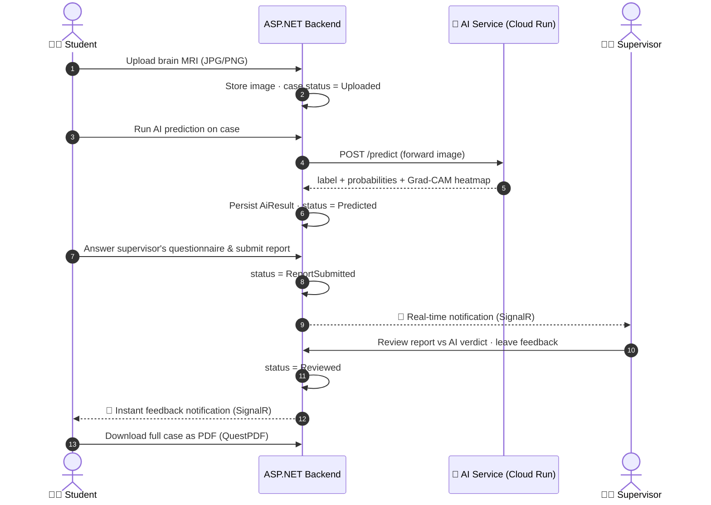

<div align="center">

# 🧠 Brainova — Backend API

### AI-Assisted Brain-Tumor MRI Training Platform for Radiology Students

*Upload an MRI → get an explainable AI prediction → write a structured diagnostic report → receive supervisor feedback in real time.*

[](https://dotnet.microsoft.com/)
[](https://learn.microsoft.com/aspnet/core)
[](https://learn.microsoft.com/ef/core)
[](https://learn.microsoft.com/aspnet/core/signalr)
[](https://jwt.io/)
[](https://azure.microsoft.com/)

**[🌐 Live App](https://brainovaproject.onrender.com/home)** · **[📚 API Docs](https://documenter.getpostman.com/view/42948249/2sBXcHiyt3)** · **[⚡ API (Azure)](https://brainova-backend-grb6egdgg2d8epdw.israelcentral-01.azurewebsites.net)** · **[⚡ API (Mirror)](http://brainova.runasp.net/)** · **[🤖 AI Service Repo](https://github.com/AbdalruhmanIssa/Brainova_AI)**

</div>

> ⚠️ **Medical disclaimer:** Brainova is an educational and decision-support tool for radiology *training* — it is **not** a diagnostic device and never a substitute for a qualified radiologist.

---

## 📖 Table of Contents

- [What is Brainova?](#-what-is-brainova)
- [The Brainova Ecosystem](#-the-brainova-ecosystem)
- [Live Deployments](#-live-deployments)
- [How It Works — The Learning Loop](#-how-it-works--the-learning-loop)
- [System Architecture](#-system-architecture)
- [Key Features](#-key-features)
- [Tech Stack](#-tech-stack)
- [Project Structure (N-Tier)](#-project-structure-n-tier)
- [Roles & Permissions](#-roles--permissions)
- [API Overview](#-api-overview)
- [Authentication & Security](#-authentication--security)
- [Real-Time Notifications](#-real-time-notifications)
- [AI Integration](#-ai-integration)
- [Data Model](#-data-model)
- [Getting Started](#-getting-started)
- [Configuration](#-configuration)
- [Deployment Notes](#-deployment-notes)
- [Documentation](#-documentation)
- [Team & Credits](#-team--credits)

---

## 🎯 What is Brainova?

**Brainova** is a graduation-project platform that trains radiology students to read brain MRI scans — with an explainable AI model as their sparring partner.

A student uploads a brain MRI, answers a structured diagnostic questionnaire authored by their supervisor, and then runs the case through a deep-learning classifier that predicts one of four classes — **glioma**, **meningioma**, **pituitary**, or **no tumor** — together with a **Grad-CAM heatmap** showing *where* the model looked. The supervisor reviews the student's report side-by-side with the AI's verdict, leaves feedback (delivered instantly via SignalR), and the whole case can be exported as a polished **PDF report**.

This repository is the **backend API** — the system's core. It owns authentication, user & role management, MRI case lifecycle, report questionnaires, feedback, dashboards, notifications, PDF generation, and the bridge to the Python AI microservice.

---

## 🌐 The Brainova Ecosystem

Brainova is split across four repositories, each owning one piece of the system:

| Repository | Role | Stack |
|---|---|---|
| **[Brainova (this repo)](https://github.com/AbdalruhmanIssa/Brainova)** | 🧩 Core backend API — auth, cases, reports, feedback, notifications, PDF | ASP.NET Core Web API (.NET 10), EF Core, SQL Server |
| **[Brainova_AI](https://github.com/AbdalruhmanIssa/Brainova_AI)** | 🤖 AI inference microservice — classification + Grad-CAM explainability | FastAPI, TensorFlow/EfficientNet, Google Cloud Run |
| **[rahafashqar/Brainova](https://github.com/rahafashqar/Brainova)** · **[shathazyadeh/BrainovaProject](https://github.com/shathazyadeh/BrainovaProject)** | 🎨 Frontend — student, supervisor & admin experience | React 19, Vite, MUI, SignalR client |

```
React Frontend  ⇄  ASP.NET Core Backend (this repo)  ⇄  FastAPI AI Service (Cloud Run)
                        │
                        ├── SQL Server (EF Core)
                        ├── SignalR hub (/hubs/notifications)
                        └── QuestPDF report engine
```

The frontend **never** talks to the AI service directly — every prediction flows through this backend, which persists results and keeps the case lifecycle consistent.

---

## 🚀 Live Deployments

| Service | URL |
|---|---|
| 🌐 **Frontend (live app)** | <https://brainovaproject.onrender.com/home> |
| ⚡ **Backend API — Azure App Service** | <https://brainova-backend-grb6egdgg2d8epdw.israelcentral-01.azurewebsites.net> |
| ⚡ **Backend API — MonsterASP mirror** | <http://brainova.runasp.net/> |
| 🤖 **AI Service — Google Cloud Run** | <https://brainova-ai-1031567223264.europe-west1.run.app/docs> |

> 📚 **[Full REST API documentation (Postman)](https://documenter.getpostman.com/view/42948249/2sBXcHiyt3)** — request/response examples with ready-to-copy snippets in 20+ languages. In local development the API also self-documents via **OpenAPI + Scalar** at `/scalar`.

---

## 🔄 How It Works — The Learning Loop



Every case moves through a strict lifecycle: **`Uploaded → Predicted → ReportSubmitted → Reviewed`** — enforced server-side so students can't skip steps.

---

## 🏗 System Architecture

The backend follows a clean **3-tier (N-Tier) architecture** with strict downward-only dependencies:

```
┌───────────────────────────────────────────────────────────────┐
│  Brainova.PL — Presentation Layer                             │
│  Controllers (per role/area) · Middleware · Program.cs · DI   │
└──────────────────────────────┬────────────────────────────────┘
                               ▼
┌───────────────────────────────────────────────────────────────┐
│  Brainova.BLL — Business Logic Layer                          │
│  Services · DTOs · Validation · Mapster mapping ·             │
│  SignalR Hub · Custom exceptions · QuestPDF composition       │
└──────────────────────────────┬────────────────────────────────┘
                               ▼
┌───────────────────────────────────────────────────────────────┐
│  Brainova.DAL — Data Access Layer                             │
│  EF Core DbContext · Entities · Repositories + Unit of Work · │
│  Entity configurations · Migrations · Data seeding            │
└───────────────────────────────────────────────────────────────┘
```

Every service is interface-driven (`IXxxService` → `XxxService`) and registered through DI, and data access goes through the **Repository + Unit of Work** pattern — controllers never touch `DbContext`.

---

## ✨ Key Features

- 🧠 **Explainable AI predictions** — 4-class brain-tumor classification with Grad-CAM heatmaps, proxied through the backend for consistency and persistence.
- 📝 **Supervisor-authored questionnaires** — supervisors define, edit, and toggle the structured report questions their students must answer per case.
- 🔁 **Full case lifecycle management** — upload, predict, report, review; every transition validated server-side.
- 💬 **Feedback system with read tracking** — supervisors comment on reports; students see unseen counts and can mark feedback seen.
- 🔔 **Real-time notifications** — SignalR hub with per-user and per-role (group) push, JWT-authenticated over WebSockets.
- 📄 **One-click PDF case reports** — QuestPDF composes the MRI, AI verdict, probabilities, student answers, and feedback into a downloadable document.
- 📊 **Role-specific dashboards** — summary statistics tailored to students and supervisors.
- 👥 **Four-tier role hierarchy** — SuperAdmin → Admin → Supervisor → Student, with granular per-endpoint authorization.
- 🔐 **Dual authentication modes** — classic Bearer JWT *and* HttpOnly cookie login with CSRF (antiforgery) protection for browser clients.
- ✉️ **Complete identity flows** — email confirmation, forgot/reset password, admin-provisioned accounts with set-password onboarding.
- 🚫 **User moderation** — block/unblock users, bulk delete, role changes, and lockout protection against brute force.
- 🌱 **Self-bootstrapping** — automatic migrations, role seeding, and initial user seeding on startup.

---

## 🛠 Tech Stack

| Concern | Technology |
|---|---|
| Framework | ASP.NET Core Web API on **.NET 10** |
| ORM / Database | **Entity Framework Core 10** + **SQL Server** |
| Identity & Auth | ASP.NET Core Identity · **JWT Bearer** · HttpOnly cookie fallback · Antiforgery (CSRF) |
| Real-time | **SignalR** (WebSockets) |
| Object mapping | **Mapster** |
| PDF generation | **QuestPDF** |
| Image processing | **SixLabors.ImageSharp** |
| ML runtime (local inference option) | **Microsoft.ML.OnnxRuntime** (EfficientNet-B1 ONNX model) |
| API docs | **OpenAPI + Scalar** (dev) |
| Email | SMTP via `IEmailSender` |
| AI microservice | FastAPI + TensorFlow on **Google Cloud Run** (see [Brainova_AI](https://github.com/AbdalruhmanIssa/Brainova_AI)) |
| Hosting | **Azure App Service** + MonsterASP mirror |

---

## 📁 Project Structure (N-Tier)

```
Brainova/
├── Brainova.PL/                  # 🎯 Presentation Layer (API host)
│   ├── Controllers/
│   │   ├── Identity/             #   AuthsController — login, register, tokens
│   │   ├── Admin/                #   User management (Admin/SuperAdmin)
│   │   ├── SuperAdmin/           #   Admin provisioning, role & password control
│   │   ├── Student/              #   Cases, AI results, reports, feedback, dashboard
│   │   ├── Supervisor/           #   Review queue, questions, feedback, students
│   │   └── AiTumorsController.cs #   AI bridge — Grad-CAM, health checks
│   ├── Middlewares/              #   Global exception → uniform JSON errors
│   ├── App_Data/                 #   Stored MRI uploads & Grad-CAM images
│   ├── wwwroot/Models/           #   ONNX model (local inference option)
│   └── Program.cs                #   DI, auth pipeline, CORS, SignalR, seeding
│
├── Brainova.BLL/                 # 🧠 Business Logic Layer
│   ├── Services/                 #   Interface/ + Classes/ — 12 domain services
│   ├── DTOs/                     #   Auth, User, Request, Response, Realtime
│   ├── Hubs/                     #   NotificationHub (SignalR)
│   ├── Mapping/                  #   Mapster configuration
│   ├── Validation/               #   Custom validation attributes
│   └── Exceptions/               #   Domain exceptions + API exception middleware
│
├── Brainova.DAL/                 # 🗄 Data Access Layer
│   ├── Data/                     #   AppDbContext, entity Configs, Migrations
│   ├── Modles/                   #   Entities: MriCase, AiResult, Report, …
│   ├── Enums/                    #   CaseStatus, ReportQuestionType
│   ├── Repositories/             #   Generic repository + Unit of Work
│   └── Utilites/                 #   SeedData (roles, users, migration on boot)

```

---

## 👥 Roles & Permissions

| Role | What they can do |
|---|---|
| 🟣 **SuperAdmin** | Everything Admin can, plus: create Admins, change any user's role, force-change passwords |
| 🔵 **Admin** | Create Supervisors & Students, list/update/block/unblock users, bulk delete |
| 🟢 **Supervisor** | Author & manage report questionnaires, browse students' cases, review submitted reports, give feedback, export PDFs, view dashboard |
| 🟡 **Student** | Upload MRI cases, run AI predictions, answer questionnaires & submit reports, track feedback, export their own PDFs, view dashboard |

Roles and a starter user set are **seeded automatically** on first run.

---

## 📡 API Overview

All endpoints are prefixed with `/api`. Routes are organized by **area** (role).

<details>
<summary><b>🔑 Identity — <code>/api/Identity/Auths</code></b></summary>

| Method | Endpoint | Description |
|---|---|---|
| POST | `/login` | Email/password → JWT access token |
| POST | `/cookie-login` | Login via **HttpOnly Secure cookie** (browser-friendly) |
| POST | `/logout` | Clear auth cookie |
| GET | `/me` | Current authenticated user profile |
| GET | `/csrf-token` | Issue antiforgery (XSRF) token for cookie mode |
| POST | `/register-student` | Student self-registration (email confirmation required) |
| GET | `/confirm-email` | Email confirmation callback |
| POST | `/forgot-password` | Send password-reset email |
| POST | `/reset-password` | Reset password with token |
| POST | `/set-password` | First-time password for admin-provisioned accounts |

</details>

<details>
<summary><b>👥 User Management — <code>/api/Identity/Users</code> (Admin / SuperAdmin)</b></summary>

| Method | Endpoint | Description |
|---|---|---|
| GET | `/all` | List all users |
| GET | `/{userId}` | Get user by id |
| GET | `/supervisors` | List supervisors |
| POST | `/create-supervisor` | Provision a supervisor account |
| POST | `/create-student` | Provision a student account |
| PUT | `/update/{userId}` | Update user info |
| PATCH | `/block/{userId}` / `/unblock/{userId}` | Moderate access |
| GET | `/isblocked/{userId}` | Check block status |
| DELETE | `/bulk-delete` | Delete multiple users |
| POST | `/create-admin` | 🟣 SuperAdmin: create an Admin |
| PATCH | `/change-password/{userId}` | 🟣 SuperAdmin: force password change |
| PUT | `/change-role` | 🟣 SuperAdmin: reassign a user's role |

</details>

<details>
<summary><b>🧑‍🎓 Student — <code>/api/Student/…</code></b></summary>

| Method | Endpoint | Description |
|---|---|---|
| POST | `/MriCases/upload` | Upload a brain MRI image |
| GET | `/MriCases/my-cases` | List own cases with status |
| GET | `/MriCases/image/{fileName}` | Fetch stored MRI image |
| POST | `/AIResults/{caseId}/predict` | Run AI prediction on a case |
| GET | `/Reports/questions` | Get supervisor's questionnaire |
| POST | `/Reports/submit` | Submit diagnostic report answers |
| GET | `/Reports/{reportId}/pdf` | Download case report as PDF |
| GET | `/Feedbacks` · `/Feedbacks/unseen` | List feedback / unseen only |
| GET | `/Feedbacks/report/{reportId}` | Feedback for a specific report |
| POST | `/Feedbacks/{id}/mark-seen` · `/Feedbacks/mark-all-seen` | Read tracking |
| GET | `/DashboardSummary` | Student dashboard statistics |

</details>

<details>
<summary><b>🧑‍⚕️ Supervisor — <code>/api/Supervisor/…</code></b></summary>

| Method | Endpoint | Description |
|---|---|---|
| GET | `/Students` | List assigned students |
| GET | `/MriCases` | Browse students' MRI cases |
| GET | `/Reports/new` | Queue of newly submitted reports |
| GET | `/Reports/{reportId}/details` | Full report vs AI verdict |
| GET | `/Reports/{reportId}/pdf` | Export report as PDF |
| POST | `/ReportQuestions` | Create questionnaire question |
| GET | `/ReportQuestions` | List own questions |
| PUT | `/ReportQuestions/{id}` | Edit a question |
| PATCH | `/ReportQuestions/{id}/toggle` | Enable/disable a question |
| POST | `/Feedbacks/report/{reportId}` | Give feedback on a report |
| GET / PUT / DELETE | `/Feedbacks…` | Manage own feedback |
| GET | `/DashboardSummary` | Supervisor dashboard statistics |

</details>

<details>
<summary><b>🤖 AI Bridge — <code>/api/AiTumors</code></b></summary>

| Method | Endpoint | Description |
|---|---|---|
| POST | `/gradcam` | Forward an image to the AI service, get prediction + heatmap |
| GET | `/gradcam-image/{fileName}` | Serve a stored Grad-CAM overlay |
| GET | `/python-health` | Health check of the Cloud Run AI service |
| GET | `/ping` | Backend liveness check |

</details>

Error responses follow one uniform shape across the entire API (enforced by global middleware and a custom model-validation factory):

```json
{ "success": false, "message": "Human-readable error message" }
```

---

## 🔐 Authentication & Security

Brainova supports **two auth modes** side by side:

1. **Bearer JWT** — `POST /login` returns a token; clients send `Authorization: Bearer <token>`.
2. **HttpOnly cookie** — `POST /cookie-login` sets a `Secure`, `HttpOnly` `access_token` cookie. Designed for browser SPAs (immune to XSS token theft) and paired with **antiforgery protection**: the SPA reads the `XSRF-TOKEN` cookie and echoes it back as the `X-XSRF-TOKEN` header.

Additional hardening baked in:

- 🔒 **ASP.NET Core Identity** password policy (length, case, digits), unique emails, and **email confirmation required** before login.
- 🛡 **Lockout** after 5 failed attempts (brute-force protection) plus an application-level `IsBlocked` flag.
- 🔑 JWT secrets are **Base64-encoded symmetric keys** with full issuer/audience/lifetime validation and zero clock skew.
- 🌐 **Forwarded-headers middleware** properly configured for TLS-terminating proxies (Render/Azure) — so `Secure` cookies survive, including on iOS Safari.
- 📶 SignalR connections authenticate via `?access_token=` query string (WebSocket upgrade can't carry headers), scoped to `/hubs` paths only.

---

## 🔔 Real-Time Notifications

A single SignalR hub at **`/hubs/notifications`** powers instant updates:

- **Per-user push** — a custom `IUserIdProvider` maps the JWT `Id` claim to the SignalR user, so the server can target `Clients.User(userId)` (e.g., "your report got feedback").
- **Per-role broadcast** — on connect, each connection joins `role:{RoleName}` groups derived from its JWT role claims, enabling broadcasts like "notify all admins".
- The client only listens — all pushes originate server-side from `NotificationService`, keeping the hub surface minimal and secure.

---

## 🤖 AI Integration

The backend talks to the [Brainova_AI](https://github.com/AbdalruhmanIssa/Brainova_AI) microservice (FastAPI + TensorFlow EfficientNet on Google Cloud Run) through a named `HttpClient` with a 5-minute timeout (cold starts + heavy inference):

1. Student triggers a prediction on an uploaded case.
2. Backend forwards the MRI to the AI service's `/predict` endpoint.
3. AI service validates the image *is actually a brain MRI*, classifies it (**glioma / meningioma / pituitary / no tumor**), and generates a **Grad-CAM heatmap** highlighting the decision-driving region.
4. Backend persists the label, per-class probabilities (JSON), and heatmap image as an `AiResult` bound 1-to-1 with the case.

An **ONNX runtime path** (EfficientNet-B1 exported to `brainova_effnetb1.onnx`) also ships with the backend as a local-inference option — useful for offline dev without the Python service.

> Model training lives in the AI repo: trained on the [Kaggle Brain Tumor MRI Dataset](https://www.kaggle.com/datasets/masoudnickparvar/brain-tumor-mri-dataset) with brain-region cropping, 240×240 input, transfer learning, and test-time augmentation.

---

## 🗃 Data Model

Core entities (see `Documentation/Diagrams/` for full ERD):

```
ApplicationUser (Identity) ──< MriCase ──1 AiResult
        │                        │
        │                        └──1 Report ──< ReportAnswer >── ReportQuestion
        │                                │
        └── Supervisor ◄── authored ─────┴──< Feedback
```

| Entity | Purpose |
|---|---|
| `ApplicationUser` | Identity user extended with domain fields (supervisor↔student assignment, block flag) |
| `MriCase` | An uploaded MRI + lifecycle status (`Uploaded → Predicted → ReportSubmitted → Reviewed`) |
| `AiResult` | AI verdict: predicted label, probabilities JSON, Grad-CAM file — unique per case |
| `Report` / `ReportAnswer` | Student's structured diagnostic submission |
| `ReportQuestion` | Supervisor-authored questionnaire item (typed via `ReportQuestionType`, toggleable) |
| `Feedback` | Supervisor's comments on a report, with seen/unseen tracking |


---

## 🏁 Getting Started

### Prerequisites

- [.NET 10 SDK](https://dotnet.microsoft.com/download)
- SQL Server (LocalDB, Express, or full instance)
- *(Optional)* Access to the AI service — the public Cloud Run instance is preconfigured

### Run locally

```bash
# 1. Clone
git clone https://github.com/AbdalruhmanIssa/Brainova.git
cd Brainova

# 2. Configure  (see Configuration section below)
#    Edit Brainova.PL/appsettings.json → connection string, JWT secret, SMTP

# 3. Run — migrations, roles, and starter users are seeded automatically
dotnet run --project Brainova.PL
```

On first launch the app **migrates the database and seeds roles + demo users** by itself — no manual `dotnet ef database update` needed.

In development, interactive API docs are available at **`/scalar`** (Scalar UI over OpenAPI).

### Solution layout

Open `Brainova.slnx` in Visual Studio 2026 / Rider — three projects: `Brainova.PL` (startup), `Brainova.BLL`, `Brainova.DAL`.

---

## ⚙️ Configuration

Settings come from `appsettings.json`, overridable by environment variables (production):

| Setting | Env var | Description |
|---|---|---|
| `ConnectionStrings:Default` | `DB_CONNECTION_STRING` | SQL Server connection string |
| `jwtOptions:SecretKey` | — | **Base64-encoded** symmetric signing key |
| `jwtOptions:Issuer` / `Audience` | — | Token issuer/audience validation |
| `jwtOptions:DurationInMinutes` | — | Access-token lifetime |
| `Smtp:*` | — | Host, port, SSL, credentials for identity emails |
| *(hosting)* | `PORT` | Listen port for PaaS platforms (defaults to 8080) |


---

## ☁️ Deployment Notes

The API is deployed on **Azure App Service** (primary) with a **MonsterASP** mirror, and is proxy-aware by design:

- **Forwarded headers first** — `X-Forwarded-Proto/For/Host` are honored before anything else in the pipeline, so the app knows it's behind HTTPS even though the platform proxy forwards plain HTTP.
- **No in-app HTTPS redirection** — TLS is terminated at the platform proxy; redirecting inside the app breaks `SameSite=None` cookies on iOS Safari.
- **Dynamic port binding** — respects the `PORT` env var (Render/Azure/Docker convention) outside development.
- **CORS with credentials** — configured to allow the SPA origin while permitting cookies and SignalR WebSockets (`AllowCredentials` + origin callback).

---

## 📚 Documentation

- 📖 **[REST API Documentation (Postman)](https://documenter.getpostman.com/view/42948249/2sBXcHiyt3)** — every endpoint with example requests, responses, and code snippets, pre-wired to the live Azure API.
- 🤖 [AI service deep-dive](https://github.com/AbdalruhmanIssa/Brainova_AI) — model training, Grad-CAM implementation, and Cloud Run deployment.

---

## 👨‍💻 Team & Credits

Brainova was built as a **graduation project** by the Brainova team:

| Area | Repo / Owner |
|---|---|
| Backend & AI service | [@AbdalruhmanIssa](https://github.com/AbdalruhmanIssa) — [Brainova](https://github.com/AbdalruhmanIssa/Brainova) · [Brainova_AI](https://github.com/AbdalruhmanIssa/Brainova_AI) |
| Backend & AI service | [@taima97](https://github.com/taima97) |
| Frontend | [@rahafashqar](https://github.com/rahafashqar) — [Brainova](https://github.com/rahafashqar/Brainova) · [@shathazyadeh](https://github.com/shathazyadeh) — [BrainovaProject](https://github.com/shathazyadeh/BrainovaProject) |

Dataset credit: Masoud Nickparvar — [Brain Tumor MRI Dataset](https://www.kaggle.com/datasets/masoudnickparvar/brain-tumor-mri-dataset) (Kaggle).

---

<div align="center">

**🧠 Brainova — where radiology students and explainable AI learn from each other.**

*If this project helps you, consider giving it a ⭐*

</div>
